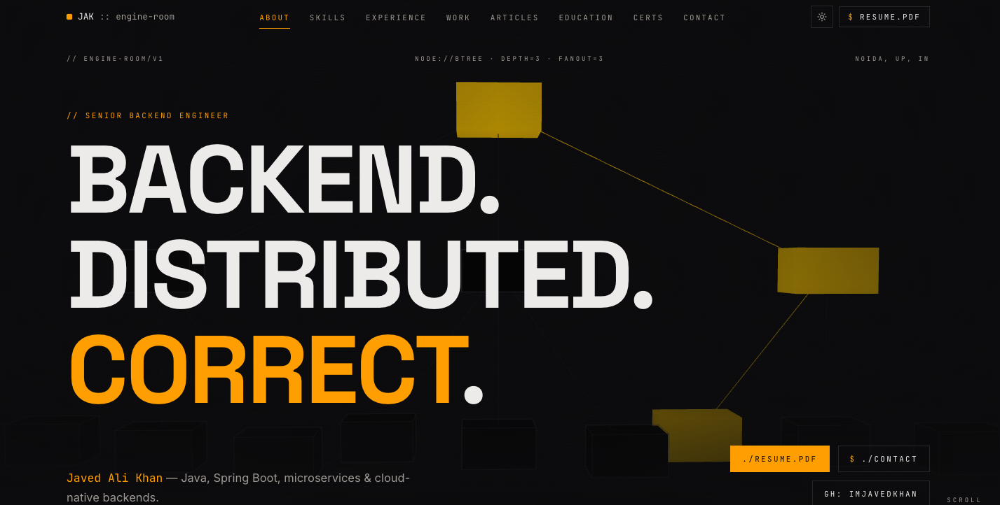
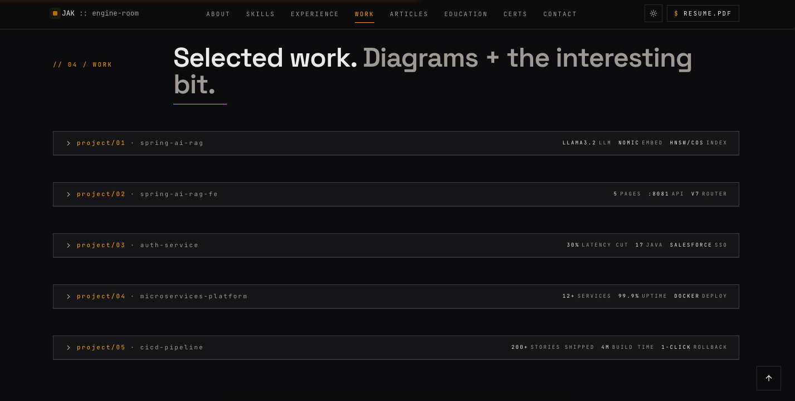
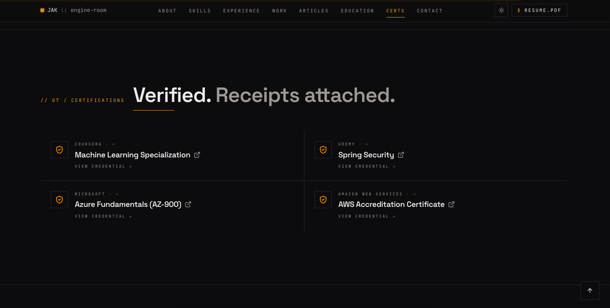
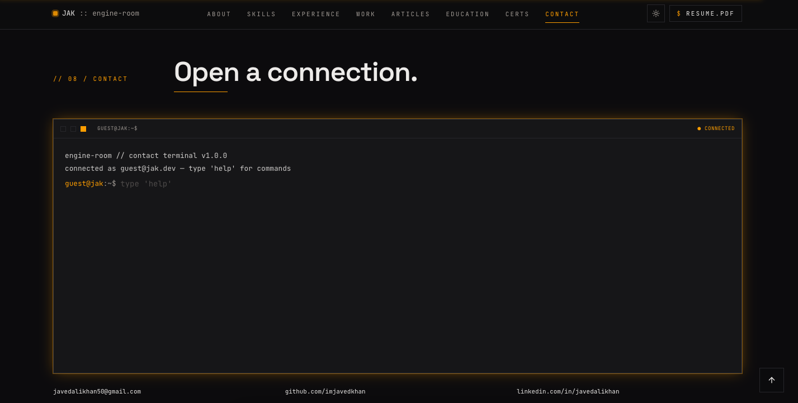

# The Engine Room — Javed Ali Khan

A single-page, dark-mode, brutalist portfolio for a senior backend engineer. Code, diagrams, and logs are the primary visual language. Amber neon on slate, monospace everywhere, and a 3D B-Tree hero animation that responds to your cursor.

> **Author:** Javed Ali Khan — Senior Software Engineer (Java · Spring Boot · Microservices · Cloud · Spring AI)
> **Contact:** [javedalikhan50@gmail.com](mailto:javedalikhan50@gmail.com) · [LinkedIn](https://linkedin.com/in/javedalikhan) · [GitHub](https://github.com/imjavedkhan) · [Medium](https://medium.com/@javedalikhan50)

---

## ✦ Screenshots

A quick tour of the four anchor sections. Drop the matching PNGs into `docs/screenshots/` (filenames listed below) and they'll render here on GitHub.

| | |
|---|---|
|  <br /> **Hero** — 3D B-Tree built with React Three Fiber, amber-on-slate type lockup, and the toggleable *“Available for hire”* status pill driven by `profile.availabilityText`. |  <br /> **Projects** — Collapsible `PROJECT/0N` panels with lazy-rendered Mermaid architecture diagrams, syntax-highlighted code snippets, and a fullscreen toggle for zooming into the details. |
|  <br /> **Certifications** — Four-up grid (Coursera, Udemy, Azure, AWS). Each card is fully clickable with an `ExternalLink` glyph and a *“view credential ↗”* affordance. |  <br /> **Contact** — Interactive terminal CLI styled like a shell prompt — try `help`, `email`, `github`, `linkedin`, or `resume` to navigate without leaving the keyboard. |

> Tip: capture screenshots at **1440×900** with the browser in dark mode for a consistent look. Save them as PNG into `docs/screenshots/` using the exact filenames above.

---

## ✦ Features

- **3D B-Tree hero** — React Three Fiber scene with mouse-driven rotation, search-path traversal pulses, and a reduced-motion SVG fallback.
- **Brutalist design system** — JetBrains Mono / Space Grotesk / Inter, hairline dividers, asymmetric grid, amber `#F59E0B` accents on a slate base. All colors are HSL semantic tokens defined in `src/index.css` and `tailwind.config.ts`.
- **"Available for hire" badge** — toggle via `profile.availableForHire` with a customisable `availabilityText` line.
- **Sections** — Hero · About (README block + live stats) · Skills matrix · Experience timeline (commit-log style) · Projects · Articles (live RSS) · Education · Certifications · Contact (interactive terminal CLI) · Footer.
- **Collapsible project panels** — each `PROJECT/0N` header has a chevron toggle; panels are collapsed by default to keep the section scannable, expand on click to reveal architecture, code, and links.
- **Mermaid architecture diagrams** — every project ships with a `flowchart` rendered via Mermaid. Diagrams are lazy-loaded, persistently cached across panel toggles for instant re-renders, and include a **fullscreen zoom mode** (Esc to close).
- **Live articles** — pulled from a Medium RSS feed via `rss2json` and cached with React Query.
- **Education & Certifications** — each item supports an optional `certificateUrl` / `url` that opens the credential in a new tab.
- **SEO** — semantic HTML, single H1, meta description, Open Graph image, sitemap, robots.txt, JSON-LD person schema.
- **Polish** — scroll progress bar, back-to-top, IntersectionObserver active-section nav, framer-motion reveal animations.

---

## ✦ Featured projects

The portfolio currently features the following projects (all editable from `src/data/portfolio.ts`):

1. **Spring AI RAG** — Spring Boot 3.5 + Spring AI 1.0 backend implementing Retrieval-Augmented Generation with Ollama (`llama3.2`, `nomic-embed-text`), PostgreSQL + pgvector (HNSW, cosine distance), Apache Tika document parsing, and a `QuestionAnswerAdvisor` augmenting the chat client. → [github.com/imjavedkhan/spring_ai_rag](https://github.com/imjavedkhan/spring_ai_rag)
2. **Spring AI RAG Frontend** — React 18 + Vite + Tailwind + React Router 7 dashboard for the RAG backend. Pages for chat, document upload, embedding generation, and document classification, all wired to Spring Boot via Axios. → [github.com/imjavedkhan/spring_ai_rag_FE](https://github.com/imjavedkhan/spring_ai_rag_FE)
3. Additional production / OSS work shuffled below — see the Projects section in the live app.

---

## ✦ Tech stack

- **Framework:** Vite 5 + React 18 + TypeScript 5
- **Styling:** Tailwind CSS v3, semantic HSL design tokens, `tailwindcss-animate`, `@tailwindcss/typography`
- **UI primitives:** shadcn/ui (Radix), lucide-react icons
- **3D / motion:** `@react-three/fiber`, `@react-three/drei`, `three`, `framer-motion`
- **Data:** `@tanstack/react-query` (RSS feed), typed content in `src/data/portfolio.ts`
- **Diagrams / code:** `mermaid` (lazy-loaded + cached), `react-syntax-highlighter`
- **Routing:** `react-router-dom`
- **Testing:** Vitest + Testing Library + jsdom

---

## ✦ Project structure

```
src/
├── components/
│   ├── BTreeHero.tsx          # R3F 3D B-Tree scene
│   ├── TopNav.tsx             # Active-section nav (IntersectionObserver)
│   ├── Reveal.tsx             # Scroll-reveal wrapper
│   ├── ScrollProgress.tsx     # Top progress bar
│   ├── BackToTop.tsx
│   ├── MermaidDiagram.tsx     # Lazy-loaded, cached, fullscreen-capable
│   ├── sections/              # Hero, About, Skills, Experience,
│   │                          # Projects (collapsible), Articles,
│   │                          # Education, Certifications,
│   │                          # Contact, Footer
│   └── ui/                    # shadcn/ui primitives
├── data/
│   └── portfolio.ts           # ⭐ All editable content lives here
├── pages/
│   ├── Index.tsx              # Single-page composition
│   └── NotFound.tsx
├── hooks/
├── lib/
└── index.css                  # Design tokens (HSL)
public/
├── og-image.jpg
├── sitemap.xml
├── robots.txt
└── resume.pdf                 # Drop your resume here
```

---

## ✦ Getting started

Requires Node 18+ and a package manager (npm / pnpm / bun).

```bash
# install
npm install

# dev server (http://localhost:8080)
npm run dev

# production build
npm run build

# preview the production build
npm run preview

# lint & test
npm run lint
npm run test
```

---

## ✦ Editing content

All copy, links, and toggles live in **`src/data/portfolio.ts`**. No component edits required.

```ts
export const profile = {
  name: "Javed Ali Khan",
  role: "Senior Software Engineer",
  email: "javedalikhan50@gmail.com",
  github: "https://github.com/imjavedkhan",
  linkedin: "https://linkedin.com/in/javedalikhan",
  resumeUrl: "/resume.pdf",
  rssFeedUrl: "https://medium.com/feed/@javedalikhan50",

  availableForHire: true,                                    // hero badge on/off
  availabilityText: "Open to new roles · remote or Noida",   // badge text
};
```

Other exports in the same file:

| Export | Drives |
|---|---|
| `stats` | About sidebar metrics |
| `aboutLines` | README-style bio paragraphs |
| `skills` | Skills matrix grid |
| `experience` | Vertical timeline |
| `projects` | Projects section (order = `PROJECT/01`, `PROJECT/02`, …) |
| `projects[].diagram` | Mermaid `flowchart` source for the architecture panel |
| `projects[].code` | Syntax-highlighted code snippet shown beside the diagram |
| `education[].certificateUrl` | Clickable certificate badge |
| `certifications[].url` | Each cert opens in a new tab |

To swap the resume, replace `public/resume.pdf`. To change the articles feed, update `profile.rssFeedUrl`. To reorder projects, just reorder the array — the `PROJECT/0N` numbering follows the array index.

---

## ✦ Design system rules

- Dark mode only by design.
- Never hard-code colors in components — use the HSL semantic tokens from `index.css` (`--background`, `--foreground`, `--primary`, `--muted`, …).
- Monospace for labels/numbers/code, display font for headlines, body font for prose.
- Restrained motion: fades and slides only, no bouncy easing.

---

## ✦ Deploying

For self-hosting, any static host works — `npm run build` produces a static bundle in `dist/`.

---

## ✦ License

Personal portfolio — content © Javed Ali Khan. Code scaffolding is free to learn from.
